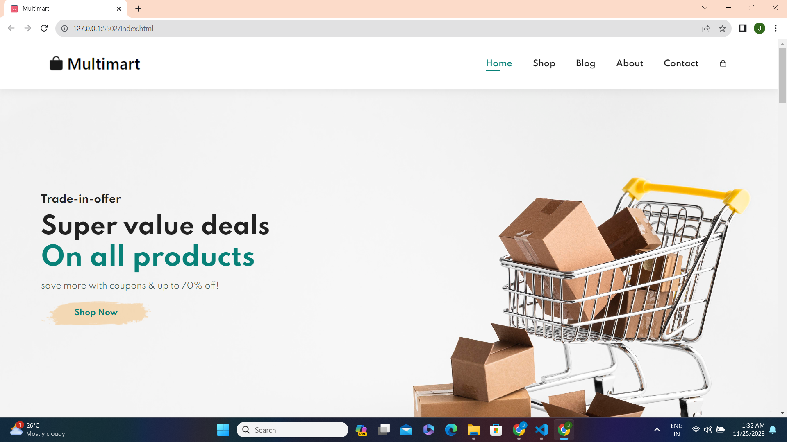

Ecommerce Website

<h3 align="center"><b>E-commerce Website</b></h3>

    <a href="https://sahadcmd.github.io/Ecommerce-Website/" target="_blank">Visit Website</a>
    ·
    <a href="https://github.com/sahadcmd/Ecommerce-Website/issues" target="_blank">Report Bug</a>
    ·
    <a href="https://github.com/sahadcmd/Ecommerce-Website/issues" target="_blank">Request Feature</a>

This is a responsive E-commerce website using HTML, CSS, and JavaScript. The website seamlessly adapts to different screen sizes, providing an optimal user experience. This project allowed me to showcase my skills in front-end web development and create a visually appealing and user-friendly online shopping platform.

# Preview

    

 
 

    

 
 

    

 
 

  

 
 

  

 
